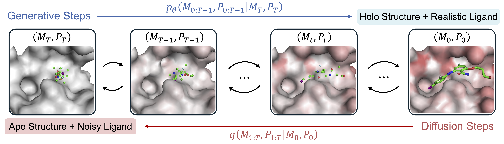

# Apo2Mol: 3D Molecule Generation via Dynamic Pocket-Aware Diffusion Models

<p align="center">
  <a href="https://arxiv.org/abs/2511.14559"></a>
  <a href="https://huggingface.co/datasets/AIDD-LiLab/Apo2Mol_Dataset"></a>
  <a href="https://aaai.org/conference/aaai/aaai-26/"></a>
  <a href="LICENSE"></a>
</p>

**Apo2Mol** is a diffusion-based framework for *de novo* 3D ligand design conditioned on apo protein pockets. Unlike holo-conditioned methods, Apo2Mol explicitly models pocket flexibility by **jointly generating the ligand and its holo-like pocket conformation**, enabling structure-based drug design in the more practical, ligand-free setting.

For full methodological details, please refer to the paper:
> **Apo2Mol: 3D Molecule Generation via Dynamic Pocket-Aware Diffusion Models**
> Xinzhe Zheng, Shiyu Jiang, Gustavo Seabra, Chenglong Li, Yanjun Li.
> *AAAI 2026* · [Paper Link](https://ojs.aaai.org/index.php/AAAI/article/view/37138)



---

## News

| Date | Update |
|------|--------|
| 2026-05 | Code released on GitHub |
| 2025-12 | [Apo2Mol Dataset](https://huggingface.co/datasets/AIDD-LiLab/Apo2Mol_Dataset) released on Hugging Face |
| 2025-11 | Apo2Mol accepted at **AAAI 2026** |

---

## 1. Environment Setup

Apo2Mol uses the **PyTorch Lightning** + **Hydra** + **Weights & Biases (W&B)** ecosystem.

```bash
bash install_env.sh
```

---

## 2. Data Preparation

Download the [Apo2Mol Dataset](https://huggingface.co/datasets/AIDD-LiLab/Apo2Mol_Dataset) from Hugging Face and place the `data_folder` under `apo2mol_dataset/`.

**Expected directory structure:**

```
apo2mol_dataset/
├── data_folder/
│   ├── 3vsv__1__1.D__1.JA/
│   ├── 6sk4__2__1.D__1.I/
│   └── ...
├── apo2mol_version/
│   ├── selected_index_apo_druglike.pkl
│   └── split_druglike.pt
└── apo2mol_checkpoint.ckpt        # pre-trained checkpoint
```

A pre-trained checkpoint (`apo2mol_checkpoint.ckpt`) is included for direct use in sampling and evaluation.

---

## 3. Training

Review the configuration files in `configs/` before launching training:

| File | Purpose |
|------|---------|
| `configs/config.yaml` | Top-level configuration |
| `configs/training.yaml` | Training hyperparameters |
| `configs/wandb.yaml` | W&B logging settings |
| `configs/sampling.yaml` | Sampling hyperparameters (used during validation) |

Then start training:

```bash
python train_pl.py
```

Logs and checkpoints are written to `outputs/`.

---

## 4. Sampling

Please select the best checkpoint based on validation metrics recorded in W&B, and update the `checkpoint_path` in `configs/sampling.yaml` accordingly before sampling.

```bash
# Single GPU
CUDA_VISIBLE_DEVICES=0 python sample_split.py

# Multi-GPU (recommended for large-scale sampling)
CUDA_VISIBLE_DEVICES=0,1,2,3 python sample_split.py
```

---

## 5. Evaluation

Compute evaluation metrics on the sampled outputs:

```bash
python eval_split.py
```

---

## Citation

If you find Apo2Mol useful in your research, please cite:

```bibtex
@inproceedings{zheng2026apo2mol,
  title={Apo2Mol: 3D molecule generation via dynamic pocket-aware diffusion models},
  author={Zheng, Xinzhe and Jiang, Shiyu and Seabra, Gustavo and Li, Chenglong and Li, Yanjun},
  booktitle={Proceedings of the AAAI Conference on Artificial Intelligence},
  volume={40},
  number={2},
  pages={1614--1622},
  year={2026}
}
```
